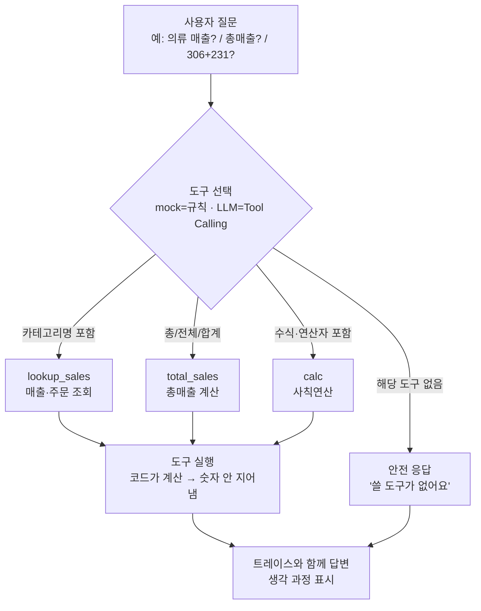

# 7주차 토요일 프로젝트 — 미니 데이터 Q&A 에이전트 (웹앱)

> **한 주 배운 것(MCP·Tool Calling·Agent)** 을 **도구를 쓰는 웹 에이전트**로 완성합니다.
> **난이도:** 중 (6주차보다 한 단계 ↑ — 도구 선택·에이전트 루프 추가) · **소요:** 4시간 · **웹 UI:** Streamlit · **AI:** mock(키 불필요) → 실제 Tool Calling(claude/openai/openrouter/CLI)
> **컨테이너에서 그대로 실행됩니다.**

## 0. 한 줄 소개
질문을 던지면 에이전트가 **도구(계산기·매출조회·총매출)** 를 골라 실행하고, **생각 과정(trace)** 과 함께 답하는 웹앱. 도구는 코드가 실행하므로 **숫자를 지어내지 않습니다.**

## 🗺️ 전체 흐름 (Flow-chart)
사용자 질문 → 에이전트가 **도구 선택**(계산기·매출조회·총매출) → **도구 실행**(코드가 계산, 숫자 안 지어냄) → **트레이스와 함께 답변**. 도구가 없으면 **"도구 없음" 안전 응답**.



## 1. 실무 시나리오
사내 데이터에 대해 누구나 자연어로 물어보면(“의류 매출?”, “총매출?”, “306+231?”), 에이전트가 알아서 도구를 골라 정확히 답하는 **사내 데이터 봇**의 최소 버전(PoC).

## 2. 사용 데이터
- `tools.py`가 생성하는 교육용 합성 매출 데이터(고정 seed, 네트워크 불필요). 실제로는 사내 매출 테이블로 교체.
- 확인일: 2026-07-14.

## 3. 이번 주 배운 것과의 연결 (D1~D4)
| Day | 프로젝트에서 |
| --- | --- |
| D1 MCP·Tool Calling 기초 | `tools.py`의 도구 정의(설명=프롬프트) |
| D2 실전 Tool 확장 | 도구 추가(calc/lookup/total) |
| D3 트렌드·운영 프레임 | 승인 게이트·로그 아이디어(더 해보기) |
| D4 Mini Agent 제작 | `agent.py`의 질문→도구선택→실행→답변 루프 |

## 4. 성공 기준 ✅
- [ ] `streamlit run app.py`가 오류 없이 뜨고 화면이 보인다(mock).
- [ ] 예시 질문 4종(카테고리 매출·총매출·계산·주문당 평균 매출)이 각각 올바른 **도구를 선택**하고 정답을 준다.
- [ ] **트레이스(생각 과정)** 가 화면에 보인다.
- [ ] 도구가 없는 질문(“날씨?”)엔 안전하게 “도구 없음”으로 답한다.
- [x] 도구 정의에 `requires_approval=True`를 설정하면 사용자 승인 전에는 실행하지 않는다.
- [ ] (선택) `AI_MODE=anthropic`로 실제 LLM이 도구를 고르게 해본다.
- [x] `tools.py`에 `avg_order`(주문당 평균 매출) 도구를 추가한다.

## 5. 단계별 진행 (4시간)
1. **(30분)** `./run.sh`로 mock 실행 → 예시 질문들 눌러보기.
2. **(40분)** `tools.py` 읽기: 도구 = 이름+설명(프롬프트)+함수. `example_01`로 도구 직접 호출.
3. **(50분)** `agent.py` 읽기: `_decide_mock`(규칙)과 `_decide_llm`(실제 Tool Calling). `example_02`로 루프 확인.
4. **(40분)** 확장 도구 `avg_order(category)`(주문당 매출)를 `TOOLS`에 등록하고 질문해보기.
5. **(40분, 선택)** `AI_MODE=anthropic ./run.sh anthropic`로 LLM이 도구를 고르게. INTEGRATION.md 참고.
6. **(20분, 선택)** 도구의 `requires_approval` 설정을 켜고, 승인/취소 UI와 실행 트레이스를 확인한다. 실제 부작용이 있는 도구를 추가할 때는 반드시 승인 대상을 지정한다.

> Windows PowerShell에서는 `pip install -r requirements.txt` 후 `python -m streamlit run app.py`로 실행합니다. `run.sh`는 Bash 환경(예: Git Bash 또는 WSL)에서 사용할 수 있습니다. 자동 테스트는 `python -m unittest discover -s tests`로 실행합니다.

### 승인 게이트
도구 등록 항목에 `"requires_approval": True`를 설정하면, 에이전트는 도구를 선택해도 즉시 실행하지 않고 `승인 대기` 트레이스를 반환합니다. 웹 UI의 **승인하고 실행** 버튼은 선택된 도구 이름과 일치하는 승인값을 다시 전달하며, **취소**를 누르면 도구 함수는 실행되지 않습니다. 승인 게이트 흐름을 시연하기 위해 읽기 전용 `avg_order` 도구를 승인 대상으로 설정했습니다. 운영 환경에서 데이터 삭제 등 부작용이 있는 도구를 추가할 때도 이 설정을 사용하세요.

## 6. 제출물
- `app.py`, `tools.py`의 추가 도구 코드, 실행 화면 캡처, 트레이스 캡처, [DATA_SOURCE.md](./DATA_SOURCE.md)의 데이터 출처 메모.

## 7. FAQ
- **앱이 안 떠요** → `pip install -r requirements.txt`. 포트 충돌 시 `--server.port 8603`.
- **엉뚱한 도구를 골라요** → 도구 `desc`(설명=프롬프트)를 더 명확히. "언제 이 도구를 쓰는지"를 적으세요(7주차 핵심).
- **실제 LLM이 mock으로 떨어져요** → 키 미설정. 트레이스의 모드를 확인.

## 8. 더 해보기
- **승인 게이트(approval gate)**: 위험한 도구(예: 데이터 삭제)는 실행 전 사용자 확인.
- **다단계**: “의류 매출과 주문당 평균을 함께 알려줘”라고 질문하면 `lookup_sales` 결과를 이어서 `calc`에 전달합니다. 트레이스에서 조회 → 계산 순서를 확인할 수 있습니다(mock 모드).
- 8주차(FastAPI)와 연결: 도구가 실제 DB를 조회하도록.

## 파일 구성
```
project/
├── Week07_Project.md   ├── app.py         ← Streamlit 웹 UI(트레이스 표시)
├── agent.py            ← 미니 에이전트(질문→도구선택→실행→답변)
├── tools.py            ← 도구 정의(계산기·매출조회·총매출·주문당 평균)
├── ai_backend.py       ← (선택) 텍스트 생성 백엔드와 mock 폴백
├── requirements.txt    ├── run.sh          ├── INTEGRATION.md
├── examples/ (example_01_tools_quickstart.py, example_02_agent_loop.py, ai_backend_example.py)
└── tests/ (도구·에이전트 자동 테스트)
```
