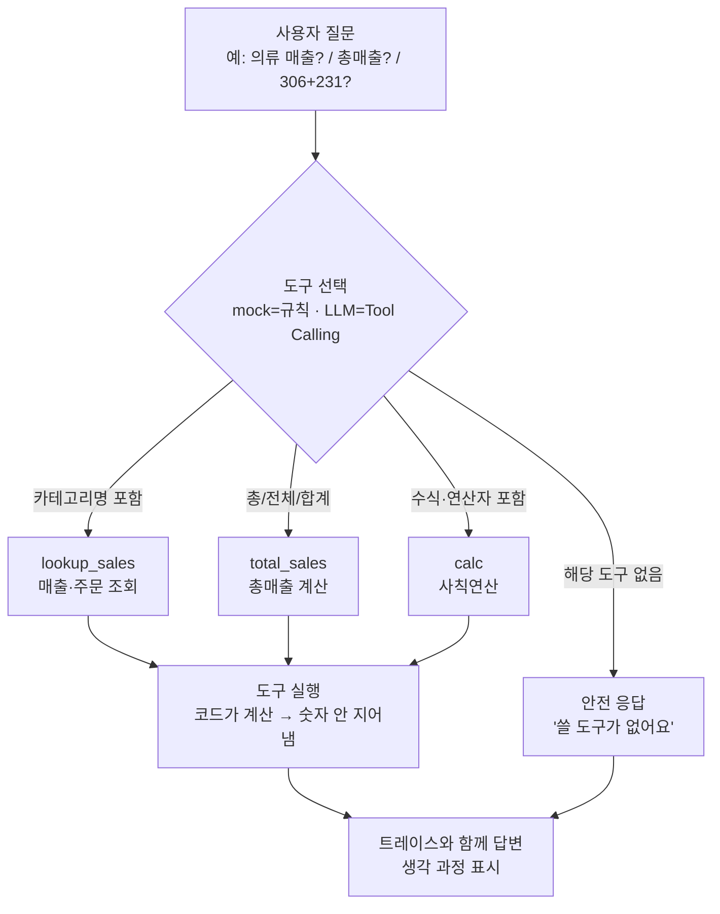

# 7주차 토요일 프로젝트 (쉬운 버전) — 미니 데이터 Q&A 에이전트 만들기

> **Vibe Coding 과제**: Claude Code(또는 Codex CLI)에게 시켜서, **질문을 던지면 에이전트가 도구를 골라 실행하고 생각 과정(트레이스)과 함께 답하는 웹앱**을 완성합니다.
> **난이도:** 중 (6주차보다 한 단계 위 — "에이전트 루프 + 도구 선택"이 추가됨) · **소요:** 4시간 · **웹 UI:** Streamlit · **AI 백엔드:** mock(키 불필요) 기본 → 원하면 실제 Tool Calling(Claude/OpenAI)
> **완성 예시 코드가 이 폴더에 있고, 테스트 완료(자동 채점 60/60)했습니다.** 컨테이너에서 그대로 실행되고, 로컬로도 됩니다.

---

## 0. 이 과제로 무엇을 얻나요
"AI가 숫자를 지어낸다"는 문제를 **도구(Tool)** 로 해결하는 경험을 얻습니다.
사용자가 자연어로 물어보면(“의류 매출?”, “총매출?”, “306+231?”), 에이전트가 **알맞은 도구를 골라 코드로 실행**하고, 정확한 숫자로 답합니다. 다 만들면:
- 버튼만 누르면 되는 **에이전트 웹앱**(`streamlit run app.py`)
- 에이전트의 **생각 과정(트레이스)** 이 화면에 단계별로 보임
- 도구가 없는 질문엔 **"도구 없음"** 으로 안전하게 답하는 처리
- 이 모든 걸 **Claude Code/Codex에게 시켜서 만든** Vibe Coding 경험

> 용어 한 줄 설명
> - **도구(Tool):** 에이전트가 골라 쓰는 함수(계산기·매출조회·총매출). 계산은 **코드**가 합니다 → 숫자를 지어내지 않음.
> - **에이전트(Agent):** LLM(두뇌) + 도구 + 반복 루프. "질문 → 도구 선택 → 실행 → 답변".
> - **Tool Calling:** LLM이 "이 도구를 이 입력으로 써줘"라고 고르는 것. 도구의 **설명(description)이 곧 프롬프트**입니다.
> - **트레이스(trace):** 에이전트가 어떤 도구를 왜 골랐는지 보여주는 "생각 과정" 기록.

---

## 🗺️ 전체 흐름 (Flow-chart)

먼저 큰 그림을 잡으세요. 사용자 질문이 들어오면 에이전트가 도구를 **고르고**, 코드가 **실행**하고, 트레이스와 함께 **답변**합니다.



---

## 🤖 AI 백엔드 6가지

이 프로젝트는 **mock(기본·무료·키 불필요)** 으로 바로 돌아갑니다. 원하면 실제 LLM이 도구를 고르게(Tool Calling) 바꿀 수 있습니다.
`ai_backend.py`(공용)는 아래 6가지를 지원하고, **어떤 모드든 실패하면 자동으로 mock으로 폴백**해서 수업이 멈추지 않습니다.

| AI_MODE 값 | 무엇 | 준비물 | 실행법(예) |
|---|---|---|---|
| **mock** | 규칙 기반(실제 AI 아님) | 없음(기본·무료) | `AI_MODE=mock streamlit run app.py` |
| **claude** | Anthropic API | `pip install anthropic` + `ANTHROPIC_API_KEY` | `AI_MODE=claude python3 examples/ai_backend_example.py` |
| **openai** | OpenAI API | `pip install openai` + `OPENAI_API_KEY` | `AI_MODE=openai python3 examples/ai_backend_example.py` |
| **openrouter** | OpenRouter | `pip install openai` + `OPENROUTER_API_KEY` | `AI_MODE=openrouter python3 examples/ai_backend_example.py` |
| **claude-cli** | 로컬 Claude CLI | `claude` 설치·로그인 | `AI_MODE=claude-cli python3 examples/ai_backend_example.py` |
| **codex-cli** | 로컬 Codex CLI | `codex` 설치·로그인 | `AI_MODE=codex-cli python3 examples/ai_backend_example.py` |

> **주의(에이전트의 도구 선택 모드):** 이 프로젝트의 `agent.py`는 도구를 **LLM으로 고르게 할 때** `AI_MODE=anthropic` 또는 `AI_MODE=openai` 를 씁니다(웹앱: `AI_MODE=anthropic streamlit run app.py`). 위 표의 6모드는 **공용 백엔드(`ai_backend.py`)** 기준입니다. 둘 다 mock이 기본입니다.

---

## 🧑‍💻 Vibe Coding으로 과제하는 법 (아주 상세)

**Vibe Coding = 내가 직접 타이핑하지 않고, AI(Claude Code/Codex)에게 "무엇을·왜·어떻게"를 시키고 실행으로 검증**하는 방식입니다. 아래 프롬프트를 순서대로 복사해 쓰세요.

**① 큰 그림 먼저 (전체 파악 + 실행)**
```text
이 폴더의 Week07_Project.md와 과제안내_쉬운버전.md를 읽어줘.
그다음 tools.py → agent.py → app.py 순서로 각 파일이 무슨 일을 하는지 초보자용으로 3줄씩 설명하고,
mock 모드로 examples/example_02_agent_loop.py 를 실제로 실행해서 결과를 보여줘.
```

**② 오류 고치기 (막혔을 때)**
```text
아래 오류가 났어. 원인을 한 줄로 설명하고, 최소 수정으로 고쳐줘. 고친 뒤 다시 실행해서 사라졌는지 확인해줘.
<오류 메시지 그대로 붙여넣기>
```

**③ 주석 보강 (이해 안 될 때)**
```text
agent.py의 run_agent 함수에 초보자용 주석을 한 줄씩 더 달아줘.
"왜 이 줄이 필요한지"를 위주로, 동작은 절대 바꾸지 말고 주석만 추가해줘.
```

**④ 기능 1개 추가 (핵심 과제 — 새 도구)**
```text
tools.py에 '주문당 평균 매출(avg_order)' 도구를 추가해줘. 입력은 카테고리명(예 '의류')이고,
매출_만원 / 주문수 를 계산해 반환해. TOOLS에 등록하고, 설명(desc)도 명확히 써줘.
그리고 agent.py의 _decide_mock에 '평균/객단가/주문당' 키워드가 들어오면 avg_order를 고르게 연결해줘.
mock 동작을 유지하고, streamlit run app.py 로 실행돼서 새 질문에 답하는지까지 확인해줘.
```

**⑤ 실제 Tool Calling 켜보기 (선택·심화)**
```text
INTEGRATION.md를 참고해서, AI_MODE=anthropic 일 때 agent.py의 _decide_llm이 실제 LLM으로 도구를 고르게 동작하는지 점검해줘.
키가 없으면 mock으로 폴백되는지도 확인하고, 트레이스에 '모드'가 제대로 찍히는지 보여줘.
```

> **좋은 프롬프트 팁(무엇·왜·어떻게·검증):**
> - **무엇을**: "avg_order 도구를 추가" 처럼 대상을 콕 집어 말하기.
> - **왜**: "주문당 매출을 알고 싶다" 처럼 목적을 함께.
> - **어떻게**: "TOOLS에 등록하고 _decide_mock에 키워드 연결" 처럼 방법을 지정(mock 유지 등 제약도).
> - **검증 요청**: "실행해서 새 질문에 답하는지 확인해줘" — **꼭** 실행·확인까지 시키기.

---

## 📦 Docker 컨테이너로 테스트

깨끗한 환경에서 그대로 돌려보고 싶으면 컨테이너를 쓰세요(자세한 건 `docker/컨테이너_사용법.md`). **로컬(내 PC)로도 됩니다.**

```bash
# 1) 빌드 (한 번만) — 04_new_lectures/ 폴더에서
docker build -t teamsparta-course -f docker/Dockerfile .

# 2) 실행 (매번) — 현재 폴더를 /work 로 마운트, 8501 포트 열기
docker run -it --rm -p 8501:8501 -v "$PWD":/work -w /work teamsparta-course bash

# 3) 컨테이너 안에서 이 주차 실행
cd week07/project
python3 examples/example_02_agent_loop.py           # 에이전트 루프 확인(키 불필요)
streamlit run app.py --server.address 0.0.0.0        # 웹앱(브라우저: http://localhost:8501)
```
> **로컬로도 가능:** Docker가 없으면 `pip install -r requirements.txt` 후 위 `streamlit run app.py` 를 그대로 실행하면 됩니다.

---

## 단계별 진행(타임박스, 총 4시간)

### 1단계 (30분) — 먼저 되는 걸 눈으로 보기
- **무엇을:** `./run.sh` 로 mock 웹앱을 띄우고 예시 질문 4종을 눌러봅니다.
- **왜:** 완성된 흐름(질문→도구→트레이스→답변)을 먼저 봐야 큰 그림이 잡힙니다.
- **어떻게:** `./run.sh` (또는 `streamlit run app.py`) → 브라우저 `http://localhost:8601`.
- 💡 Vibe 힌트: *"run.sh로 mock 웹앱을 실행하고, 예시 질문 4개의 트레이스가 어떻게 다른지 설명해줘."*

### 2단계 (40분) — 도구(tools.py) 이해하기
- **무엇을:** 도구 = **이름 + 설명(desc=프롬프트) + 함수**. `TOOLS`에 3개(calc·lookup_sales·total_sales)가 등록돼 있습니다.
- **왜:** 계산·조회를 **코드**가 하므로 숫자를 지어내지 않습니다(할루시네이션 차단).
- **어떻게:** `python3 examples/example_01_tools_quickstart.py` 로 도구를 직접 호출해 봅니다.
- 💡 Vibe 힌트: *"tools.py의 TOOLS 구조를 표로 정리하고, desc가 왜 '프롬프트'인지 설명해줘."*

### 3단계 (50분) — 에이전트 루프(agent.py) 이해하기
- **무엇을:** `_decide_mock`(규칙으로 도구 선택), `_decide_llm`(실제 Tool Calling), `run_agent`(질문→선택→실행→답변).
- **왜:** 이게 이번 주 핵심 — **에이전트 루프 + 도구 선택**입니다.
- **어떻게:** `python3 examples/example_02_agent_loop.py` 로 루프가 어떤 도구를 고르는지 확인.
- 💡 Vibe 힌트: *"run_agent가 반환하는 (answer, trace)가 각각 뭔지, 도구를 못 고르면 어떻게 되는지 코드로 짚어줘."*

### 4단계 (40분) — 새 도구 1개 추가 (핵심 과제)
- **무엇을:** `avg_order(category)`(주문당 평균 매출) 같은 도구를 추가하고 `TOOLS`에 등록.
- **왜:** 도구를 늘리는 경험이 에이전트 확장의 기본입니다.
- **어떻게:** 위 **Vibe Coding 프롬프트 ④** 를 그대로 사용 → 등록 후 새 질문으로 검증.
- 💡 Vibe 힌트: *"avg_order 추가 후 '의류 객단가 알려줘'가 avg_order를 고르는지 트레이스로 확인해줘."*

### 5단계 (40분, 선택) — 실제 LLM이 도구 고르게
- **무엇을:** `AI_MODE=anthropic ./run.sh anthropic` 로 LLM이 도구를 선택(Tool Calling).
- **왜:** 규칙 대신 LLM이 도구를 고르는 진짜 에이전트를 체험.
- **어떻게:** `INTEGRATION.md` 참고. 키 없으면 자동 mock 폴백(정상).

### 6단계 (20분, 선택) — 안전장치 다듬기
- **무엇을:** 도구 없는 질문의 안전 응답 문구를 개선하거나, "승인 게이트(위험한 도구는 사용자 확인 후 실행)" 아이디어 추가.
- **어떻게:** CLI(`claude`/`codex`)에게 시키고 `streamlit run app.py`로 검증.

---

## ✅ 성공 기준
- [ ] `streamlit run app.py`(또는 `./run.sh`)가 오류 없이 뜨고 화면이 보인다(mock).
- [ ] 예시 질문 4종이 각각 올바른 **도구를 선택**하고 정답을 준다.
- [ ] **트레이스(생각 과정)** 가 화면에 단계별로 보인다.
- [ ] 도구가 없는 질문("날씨?")엔 안전하게 **"도구 없음"** 으로 답한다.
- [ ] `python3 채점.py .` 결과가 **중(3개) 이상**, 목표는 **상(4~5개)**.
- [ ] (선택) `tools.py`에 새 도구 1개(예: `avg_order`)를 추가한다.
- [ ] (선택) `AI_MODE=anthropic`로 실제 LLM이 도구를 고르게 해본다.

---

## 📋 자주 막히는 곳 (FAQ)
- **앱이 안 떠요** → `pip install -r requirements.txt`. 포트 충돌 시 `streamlit run app.py --server.port 8603`.
- **엉뚱한 도구를 골라요** → 도구 `desc`(설명=프롬프트)를 더 명확히. "언제 이 도구를 쓰는지"를 적으세요(7주차 핵심).
- **실제 LLM이 mock으로 떨어져요** → 키 미설정/오류입니다(정상 폴백). **트레이스의 '모드'** 를 확인하세요.
- **한글 카테고리를 못 찾아요** → `lookup_sales`는 정확한 카테고리명(의류/신발/가방/액세서리/뷰티)을 받습니다. 오타·띄어쓰기 주의.
- **AI가 만든 코드에 오류가 나요** → 오류 메시지를 그대로 복사해 "이 오류 고쳐줘"라고 하세요(Vibe Coding의 핵심).

---

## 파일 구성
```
week07/project/
├── Week07_Project.md          ← 상세 규격(정식 문서)
├── 과제안내_쉬운버전.md         ← (이 문서) 초보자용 안내
├── 채점기준_평가지표.md         ← 6개 지표·상중하 기준
├── 채점.py                     ← 자동 채점기 (python3 채점.py .)
├── app.py                      ← Streamlit 웹 UI(트레이스 표시)
├── agent.py                    ← 미니 에이전트(질문→도구선택→실행→답변)
├── tools.py                    ← 도구 정의(calc·lookup_sales·total_sales)
├── ai_backend.py               ← 공용 AI 백엔드(6모드, 실패 시 mock 폴백)
├── requirements.txt   run.sh   INTEGRATION.md
└── examples/ (example_01_tools_quickstart.py, example_02_agent_loop.py, ai_backend_example.py)
```

---

> 이 문서는 **쉬운 안내판**이고, 상세 규격은 **Week07_Project.md** 를 보세요.
