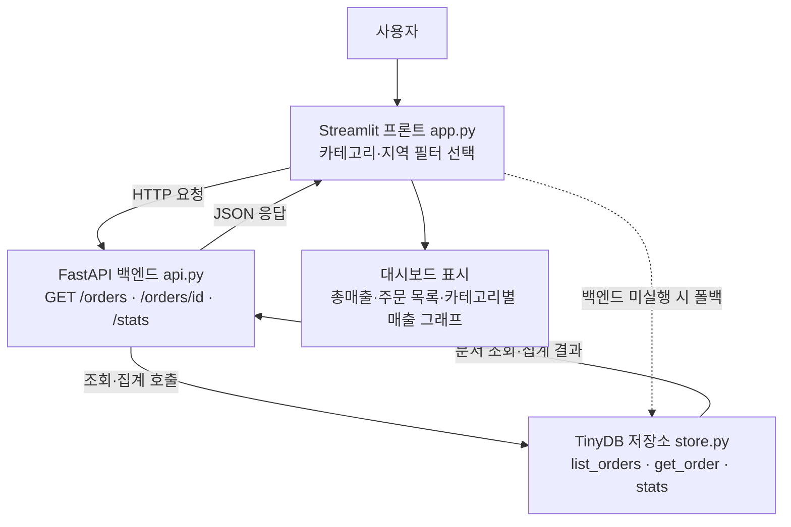

# 8주차 토요일 프로젝트 — 주문 조회 API 서비스 (웹앱)

> **한 주 배운 것(문서형 DB·FastAPI·데이터 조회)** 을 **백엔드 API + 프론트 대시보드**로 완성합니다.
> **난이도:** 중상 (7주차보다 ↑ — 프론트·백엔드·저장소 3계층) · **소요:** 4시간 · **구조:** Streamlit(프론트) → FastAPI(백엔드) → TinyDB(저장소) · **컨테이너 검증 완료.**

## 0. 한 줄 소개
주문 데이터를 **API로 조회·집계**하고, **대시보드**로 보여주는 서비스. 서버 없이도(store 폴백) 실습됩니다.

## 🗺️ 전체 흐름 (Flow-chart)


## 1. 실무 시나리오
사내 주문 데이터를 여러 화면·팀이 공유하려면 **API 서버**가 필요합니다. "조건 조회(카테고리·지역), 상세 조회, 집계"를 제공하는 최소 데이터 서비스(PoC).

## 2. 사용 데이터
- `store.py`가 생성하는 교육용 합성 주문 데이터(TinyDB, 고정 seed). 실무에선 MongoDB로 교체(INTEGRATION.md).
- 확인일 2026-07-14.

## 3. 이번 주 배운 것과의 연결 (D1~D4)
| Day | 프로젝트에서 |
| --- | --- |
| D1 MongoDB 개념·CRUD | `store.py`의 Create/Read/Query/Aggregate |
| D2 MongoDB 실전 | 조건 조회(카테고리·지역)·집계 |
| D3 FastAPI 기본 | `api.py`의 GET/POST 엔드포인트, 자동 문서 `/docs` |
| D4 클라우드 개요 | 배포 개념(로컬 실행 우선) |

## 4. 성공 기준 ✅
- [ ] `uvicorn api:app --port 8000` 실행 → `http://localhost:8000/docs`에서 API 문서가 보인다.
- [ ] `curl /orders?category=의류` 등 조건 조회가 된다.
- [ ] `/orders/{id}` 상세 조회, 없는 id는 404.
- [ ] `/stats` 집계(총매출·카테고리별)가 나온다.
- [ ] `streamlit run app.py` 대시보드가 뜨고, 필터로 조회된다.
- [ ] (선택) `POST /orders`로 새 주문을 추가한다.

## 5. 단계별 진행 (4시간)
1. **(30분)** `python3 store.py`로 데이터·CRUD 확인. `example_01`.
2. **(50분)** `api.py` 읽기 → `uvicorn api:app --port 8000` → 브라우저 `/docs`에서 눌러보기.
3. **(40분)** `example_02`(TestClient)로 서버 없이 API 테스트. 엔드포인트 추가(예: `/orders?status=취소`).
4. **(50분)** `streamlit run app.py` 프론트 → 필터·집계 대시보드 확인.
5. **(30분, 선택)** 새 조회 조건/집계 추가(예: 지역별 매출 그래프).
6. **(20분, 선택)** CLI(claude/codex)로 "월별 집계 엔드포인트" 추가 시키기.

## 6. 제출물
- `api.py`·`app.py`(수정본), `/docs` 캡처, 대시보드 캡처, 데이터 출처 메모.

## 7. FAQ
- **`uvicorn: command not found`** → `pip install -r requirements.txt`.
- **프론트가 데이터를 못 가져와요** → 백엔드가 떠 있는지 확인. 안 떠 있어도 app은 store를 직접 읽어요("직접(store)" 표시).
- **404가 나요** → 없는 order_id입니다(정상 동작).

## 8. 더 해보기
- **정렬·페이지네이션**: `GET /orders`는 `limit`(기본 20, 1~500), `offset`(기본 0, 0 이상), `sort_by`(`id`·`order_date`·`total`·`category`·`region`, 기본 `id`), `sort_order`(`asc` 또는 `desc`, 기본 `asc`)를 지원합니다. 예: `/orders?limit=10&offset=20&sort_by=total&sort_order=desc`. 잘못된 값은 HTTP 422로 응답합니다.
- **지역별 집계**: `GET /stats/region`은 전체 주문 수·매출(`total_orders`, `total_sales`)과 지역별 주문 수·매출(`region_counts`, `region_sales`)을 반환합니다. `category`, `region`, `status` 필터를 지원합니다.
- **월별 집계**: `GET /stats/month`는 전체 주문 수·매출과 월별 주문 수·매출(`month_counts`, `month_sales`)을 반환합니다. `category`, `region`, `status` 필터를 지원합니다. 예: `/stats/month?category=의류&region=서울`.
- 9주차와 연결: 이 API를 Streamlit 대시보드로 더 풍부하게.

## 파일 구성
```
project/
├── Week08_Project.md  ├── store.py   ← 저장소(TinyDB, CRUD/집계)
├── api.py             ← FastAPI 백엔드(GET/POST, /docs 자동문서)
├── app.py             ← Streamlit 프론트(API 호출, store 폴백)
├── requirements.txt   ├── run.sh    ├── INTEGRATION.md
└── examples/ (example_01_store_crud.py, example_02_api_testclient.py)
```
