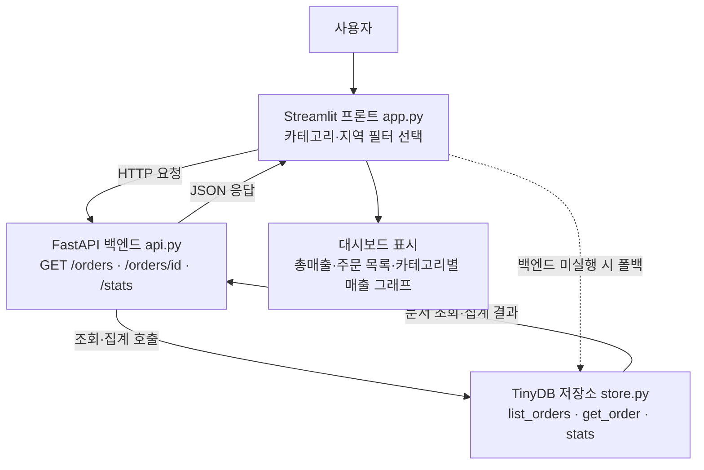

# 8주차 토요일 프로젝트 (쉬운 버전) — 주문 조회 API 서비스 만들기

> **Vibe Coding 과제**: Claude Code(또는 Codex CLI)에게 시켜서, **저장소(store) → API(api) → 대시보드(app)** 3단 구조의 데이터 서비스를 완성합니다.
> **난이도:** 중상 (7주차보다 한 단계 위 — 백엔드 API + 저장소 + 프론트 3개를 엮습니다) · **소요:** 4시간 · **웹 UI:** Streamlit · **API:** FastAPI(자동 문서 `/docs`) · **AI:** mock(키 불필요) 기본, 원하면 claude/openai/CLI 연동
> **완성 예시가 이 폴더에 있고, 컨테이너에서 테스트 완료했습니다.** 서버가 없어도 프론트가 저장소를 직접 읽는 **폴백**이 있어 초보자도 막힘 없이 실습됩니다.

용어 한 줄 설명:
- **저장소(store)**: 데이터를 담아두고 꺼내오는 곳. 여기선 **TinyDB**(서버 없이 JSON 파일로 동작하는 문서형 DB, MongoDB와 개념이 같음).
- **API(백엔드)**: 데이터를 "요청하면 JSON으로 답해주는" 서버. 여기선 **FastAPI**.
- **프론트(대시보드)**: 사람이 보는 화면. 여기선 **Streamlit**.

---

## 0. 이 과제로 무엇을 얻나요
"주문 데이터"를 **조건으로 조회**하고 **집계(총매출·카테고리별)** 해서 **대시보드**로 보여주는 서비스를 직접 만듭니다. 다 만들면:
- 브라우저에서 눌러보는 **API 자동 문서**(`http://localhost:8000/docs`)
- 필터로 조회되는 **Streamlit 대시보드**(`streamlit run app.py`)
- 이 모든 걸 **Claude Code/Codex에게 시켜서 만든** Vibe Coding 경험

---

## 🗺️ 전체 흐름 (Flow-chart)
큰 그림을 먼저 잡으세요. 데이터는 **아래에서 위로** 흐릅니다(저장소 → API → 화면).



- **정상 경로**: 화면(app) → API(api) → 저장소(store) → 다시 화면으로 JSON.
- **폴백(점선)**: 백엔드를 안 켰어도 `app.py`가 `store.py`를 **직접** 읽어 동작합니다(화면에 "직접(store)"로 표시).

---

## 1. 진행 방법 (딱 2가지만 기억)

### 방법 A. 완성 예시 먼저 돌려보기 (추천 시작점)
> **먼저 되는 걸 눈으로 보고 시작**하면 훨씬 쉽습니다.
```bash
pip install -r requirements.txt          # 내 PC에 설치 (가상환경 권장)
python3 store.py                          # 저장소·CRUD·집계 동작 확인
python3 examples/example_02_api_testclient.py   # 서버 없이 API 테스트 → 끝에 "END-TO-END OK"
uvicorn api:app --port 8000               # 터미널 A: 백엔드 (브라우저 http://localhost:8000/docs)
streamlit run app.py                      # 터미널 B: 대시보드 (브라우저 http://localhost:8501)
```

### 방법 B. Vibe Coding으로 직접 만들기 (과제)
1. 이 폴더의 **`Week08_Project.md`**(상세 규격)를 엽니다.
2. Claude Code(또는 Codex CLI)에 그 내용을 붙여넣고 이렇게 말합니다:
   > "아래 Week08_Project.md를 읽고, **store.py → api.py → app.py 순서로** 하나씩 만들어줘.
   > 각 파일을 만들면 **실제로 실행해서 확인**하고 다음으로 넘어가줘.
   > api.py는 `examples/example_02_api_testclient.py`로 검증해줘."
3. AI가 만드는 코드를 보면서 한 단계씩 실행합니다. 막히면 오류 메시지를 그대로 붙여넣고 "이 오류 고쳐줘"라고 하면 됩니다.

---

## 2. 만들 것 (한눈에)

| 순서 | 파일 | 하는 일 | 확인 방법 |
| --- | --- | --- | --- |
| 1 | `store.py` | 저장소(TinyDB). 데이터 생성(seed)·조건 조회(list_orders)·상세(get_order)·집계(stats) | `python3 store.py` |
| 2 | `api.py` | FastAPI 백엔드. `GET /orders`·`GET /orders/{id}`·`POST /orders`·`GET /stats` + 자동 문서 `/docs` | `uvicorn api:app --port 8000` → `/docs` |
| 3 | `app.py` | Streamlit 대시보드. API 호출 + 백엔드 없으면 store 폴백 | `streamlit run app.py` |

---

## 🤖 AI 백엔드 6가지 (선택 확장)
이번 과제의 핵심은 조회 API지만, "AI로 매출 요약" 같은 확장을 붙일 때 아래 6가지 백엔드를 쓸 수 있습니다.
`from ai_backend import ask` 한 줄로 부르고, 실패하면 자동으로 **mock**으로 떨어집니다(무료·키 불필요).

| 모드(AI_MODE) | 준비물 | 실행법 |
| --- | --- | --- |
| **mock** (기본) | 없음 (무료) | `AI_MODE=mock python3 examples/ai_backend_example.py` |
| claude | `ANTHROPIC_API_KEY` | `AI_MODE=claude python3 examples/ai_backend_example.py` |
| openai | `OPENAI_API_KEY` | `AI_MODE=openai python3 examples/ai_backend_example.py` |
| openrouter | `OPENROUTER_API_KEY` | `AI_MODE=openrouter python3 examples/ai_backend_example.py` |
| claude-cli | 로컬 `claude` CLI 로그인 | `AI_MODE=claude-cli python3 examples/ai_backend_example.py` |
| codex-cli | 로컬 `codex` CLI 로그인 | `AI_MODE=codex-cli python3 examples/ai_backend_example.py` |

> 키가 없거나 CLI가 없으면 **자동으로 mock**으로 동작합니다(정상). 과제 통과에는 mock만으로 충분합니다.

---

## 🧑‍💻 Vibe Coding으로 과제하는 법 (아주 상세)
Claude Code/Codex에 그대로 붙여넣을 수 있는 **입력 프롬프트 예시**입니다. 순서대로 시켜보세요.

1. **전체 만들기(단계별 + 매번 실행)**
   > "이 폴더의 `Week08_Project.md`를 읽고, **store.py → api.py → app.py 순서로** 하나씩 만들어줘.
   > 각 파일을 만들 때마다 실행해서 결과를 보여주고, api.py는 `examples/example_02_api_testclient.py`로 검증한 뒤 다음으로 넘어가줘."
2. **오류 고치기(붙여넣기)**
   > "이 오류 메시지를 고쳐줘: `<터미널에 나온 오류 전체를 그대로 붙여넣기>`. 왜 났는지도 한 줄로 알려줘."
3. **초보자용 주석 달기**
   > "`store.py`의 `list_orders`, `stats` 함수에 **비전공자도 이해할 주석**을 한 줄씩 더 달아줘. 동작은 바꾸지 마."
4. **기능 1개 추가 + 검증**
   > "`api.py`에 **지역별 매출 집계 엔드포인트 `GET /stats/region`** 을 추가하고, `store.py`에 필요한 함수도 만들어줘.
   > 추가 후 `example_02`에 호출 코드를 넣어 실행 검증까지 해줘."
5. **CLI로 확장(선택)**
   > "`GET /orders`에 **정렬·페이지네이션(limit/offset)** 을 추가하고, 없는 값이 오면 기본값으로 처리해줘. 실행해서 확인해줘."

**좋은 프롬프트 팁 (무엇을·왜·어떻게·검증):**
- **무엇을**: "지역별 매출 엔드포인트를 추가" (목표를 한 문장으로)
- **왜**: "대시보드에 지역 그래프를 그리려고" (이유가 있으면 AI가 더 맞게 만듦)
- **어떻게**: "store.py에 함수 추가 → api.py에 라우트 추가" (경로를 지정)
- **검증요청**: "만들고 나서 꼭 실행해서 결과를 보여줘" (한 번에 끝까지)

---

## 📦 Docker 컨테이너로 테스트 (선택 — 로컬로도 됩니다)
"환경이 꼬였을 때 깨끗하게 재현"하는 안전장치입니다. (자세한 건 `docker/컨테이너_사용법.md`)

```bash
# 1) 빌드 (한 번만, 04_new_lectures/ 폴더에서)
docker build -t teamsparta-course -f docker/Dockerfile .

# 2) 실행 (포트 3개 열고 현재 폴더 마운트)
docker run -it --rm -p 8501:8501 -p 8000:8000 -p 8600:8600 -v "$PWD":/work -w /work teamsparta-course bash

# 3) 컨테이너 안에서 이 주차 실행
cd week08/project
uvicorn api:app --host 0.0.0.0 --port 8000            # 백엔드 (브라우저 http://localhost:8000/docs)
streamlit run app.py --server.address 0.0.0.0         # 대시보드 (브라우저 http://localhost:8501)
```
> **로컬로도 가능**: Docker가 없으면 `pip install -r requirements.txt` 후 위 `uvicorn`/`streamlit` 명령만 그대로 쓰면 됩니다.

---

## 3. 단계별 진행 (타임박스, 총 4시간)
각 단계는 **무엇을 / 왜 / 어떻게** 순서로 봅니다. Vibe 프롬프트 힌트도 함께.

### 1단계 (30분) — 저장소 확인: `store.py`
- **무엇을**: 주문 데이터를 만들고(seed) 조건 조회·집계가 되는지 본다.
- **왜**: 데이터가 있어야 API도 화면도 의미가 있습니다(맨 아래 토대).
- **어떻게**: `python3 store.py` → "seed 60건", "의류 주문 수", "order 1", "stats"가 출력되면 OK. `examples/example_01_store_crud.py`도 실행.
- **Vibe 힌트**: "`store.py`를 실행해서 각 출력이 무슨 의미인지 한 줄씩 설명해줘."

### 2단계 (50분) — 백엔드 API: `api.py`
- **무엇을**: FastAPI로 `GET /orders`, `GET /orders/{id}`, `POST /orders`, `GET /stats`를 띄운다.
- **왜**: 여러 화면·팀이 같은 데이터를 쓰려면 "요청하면 JSON을 주는" 서버가 필요합니다.
- **어떻게**: `uvicorn api:app --port 8000` → 브라우저 `http://localhost:8000/docs`에서 각 버튼을 눌러 실행("Try it out").
- **Vibe 힌트**: "`api.py`의 각 엔드포인트가 store.py의 어떤 함수를 부르는지 표로 정리해줘."

### 3단계 (40분) — 서버 없이 API 테스트: `TestClient`
- **무엇을**: 서버를 안 띄우고도 코드로 API를 호출해 본다.
- **왜**: 매번 서버를 켜지 않아도 빠르게 검증할 수 있습니다(테스트 습관).
- **어떻게**: `python3 examples/example_02_api_testclient.py` → 끝에 **"END-TO-END OK"**. `/orders/99999`가 **404**인지 확인.
- **Vibe 힌트**: "example_02에 `GET /orders?region=서울` 호출을 추가하고 실행해줘."

### 4단계 (50분) — 프론트 대시보드: `app.py`
- **무엇을**: Streamlit으로 필터·지표·표·그래프가 있는 대시보드를 띄운다.
- **왜**: 사람이 보는 최종 결과물. 필터로 조회하고 집계를 그래프로 봅니다.
- **어떻게**: `streamlit run app.py` → 사이드바에서 카테고리·지역 필터 → 총매출·주문 목록·카테고리별 그래프 확인. 백엔드를 껐다 켜며 "API"/"직접(store)" 표시가 바뀌는지 관찰.
- **Vibe 힌트**: "app.py 사이드바에 '상태(완료/취소) 필터'를 추가하고 실행해줘."

### 5단계 (30분, 선택) — 조회·집계 확장
- **무엇을**: 지역별/월별 매출 같은 새 집계나 정렬·페이지네이션을 추가.
- **어떻게**: 위 "Vibe Coding 4·5번" 프롬프트를 그대로 사용.

### 6단계 (20분, 선택) — CLI로 엔드포인트 추가
- **무엇을**: `claude`/`codex` CLI에게 "월별 집계 엔드포인트 추가"를 시켜보고 실행 검증.

---

## ✅ 성공 기준 (이게 되면 성공)
- [ ] `uvicorn api:app --port 8000` 실행 → `http://localhost:8000/docs`에서 API 문서가 보인다.
- [ ] `curl "http://localhost:8000/orders?category=의류"` 등 조건 조회가 된다.
- [ ] `/orders/{id}` 상세 조회가 되고, 없는 id는 **404**가 나온다.
- [ ] `/stats` 집계(총매출·카테고리별)가 나온다.
- [ ] `streamlit run app.py` 대시보드가 뜨고, 필터로 조회된다(백엔드 없으면 "직접(store)"로 폴백).
- [ ] (선택) `POST /orders`로 새 주문을 추가한다.

> 자동 채점: 이 폴더에서 `python3 채점.py .` 를 실행하면 지표별 O/X·점수·등급이 나옵니다.

---

## 📋 자주 막히는 곳 (FAQ)
- **`uvicorn: command not found`** → `pip install -r requirements.txt` 먼저.
- **`ModuleNotFoundError: tinydb`(또는 fastapi)** → 같은 이유. `pip install -r requirements.txt`.
- **프론트가 데이터를 못 가져와요** → 백엔드(`uvicorn`)가 떠 있는지 확인. 안 떠 있어도 app은 store를 직접 읽어요(화면에 "직접(store)" 표시 — 정상).
- **404가 나요** → 없는 `order_id`입니다(정상 동작 확인용).
- **한글 조회가 안 돼요(curl)** → 주소에 한글이 있으면 따옴표로 감싸세요: `curl "http://localhost:8000/orders?category=의류"`.
- **포트가 겹쳐요** → `--port 8001`처럼 바꾸고, 프론트는 `API_URL=http://localhost:8001 streamlit run app.py`.
- **AI가 만든 코드에 오류가 나요** → 오류 메시지를 그대로 복사해 "이 오류 고쳐줘"라고 하세요(Vibe Coding의 핵심).

---

## 파일 구성
```
week08/project/
├── Week08_Project.md          ← 상세 규격(정식 명세)
├── 과제안내_쉬운버전.md        ← (이 문서)
├── 채점기준_평가지표.md         ← 6개 지표·상/중/하 기준
├── 채점.py                    ← 자동 채점기 (python3 채점.py .)
├── store.py                   ← 저장소(TinyDB, CRUD/집계)
├── api.py                     ← FastAPI 백엔드(GET/POST, /docs 자동문서)
├── app.py                     ← Streamlit 프론트(API 호출, store 폴백)
├── ai_backend.py              ← AI 백엔드 6종 (선택 확장용)
├── requirements.txt  run.sh  INTEGRATION.md
└── examples/
    ├── example_01_store_crud.py       ← 저장소 CRUD 예제
    ├── example_02_api_testclient.py   ← 서버 없이 API 테스트
    └── ai_backend_example.py          ← AI 백엔드 호출 예제
```

> 이 문서는 **쉬운 안내판**이고, 상세 규격은 `Week08_Project.md` 를 보세요.
