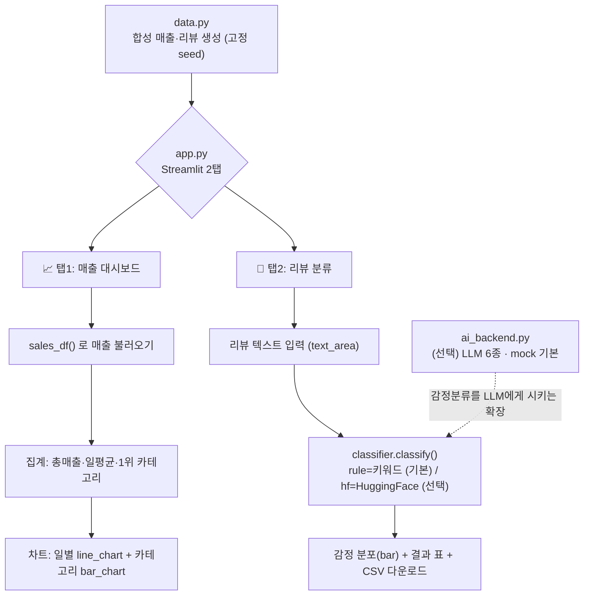

# 9주차 토요일 프로젝트 (쉬운 버전) — 매출 대시보드 + 리뷰 분류기 웹앱

> **Vibe Coding 과제**: Claude Code(또는 Codex CLI)에게 시켜서, 합성 데이터로 **매출 차트 대시보드**를 만들고, 리뷰를 **자동 분류**하는 **2탭 웹앱**을 완성합니다.
> **난이도:** 중상 (8주차보다 한 단계 위 — 시각화 대시보드 + 텍스트 분류 결합) · **소요:** 3~4시간 · **웹 UI:** Streamlit(2탭) · **분류:** 규칙 기반(기본, 키·모델 불필요) → HuggingFace(선택) · **AI 백엔드:** mock(기본, 무료) + 5종
> **완성 예시가 이 폴더에 있고, 컨테이너에서 테스트 완료**했습니다. 로컬(내 PC)에서도 동일하게 됩니다.

---

## 0. 이 과제로 무엇을 얻나요
가짜(합성) 매출·리뷰 데이터로 시작해서 **"데이터 → 집계/분류 → 차트·표·CSV"** 로 이어지는
**데이터 웹앱** 한 개를 직접 만든 경험을 얻습니다. 다 만들면:
- **탭1(매출 대시보드)**: 총매출·일평균·1위 카테고리 지표 + 일별 추이(line) + 카테고리별(bar) 그래프
- **탭2(리뷰 분류)**: 리뷰를 붙여넣으면 → 긍정/부정/중립 자동 분류 → 감정 분포·표·**CSV 다운로드**
- 이 모든 걸 **Claude Code/Codex에게 시켜서 만든** Vibe Coding 경험

> 용어 한 줄: **대시보드**=여러 지표·그래프를 한 화면에 모아 보는 것. **분류(classification)**=글을 "긍정/부정"처럼 정해진 칸으로 나누는 대표적인 머신러닝 작업.

---

## 🗺️ 전체 흐름 (Flow-chart)

먼저 큰 그림부터 잡으세요. 데이터에서 시작해 두 갈래(매출 탭 / 리뷰 탭)로 나뉩니다.



---

## 1. 진행 방법 (딱 3가지만 기억)

### 방법 A. 완성 예시 먼저 돌려보기 (추천 시작점)
> **먼저 되는 걸 눈으로 보고 시작**하면 훨씬 쉽습니다.
```bash
cd week09/project
pip install -r requirements.txt      # 내 PC에 설치 (가상환경 권장)
python3 data.py                      # 데이터 확인 (sales/reviews 크기 출력)
python3 classifier.py                # 분류기 확인 (긍정/부정/중립 예시)
./run.sh                             # 웹앱 열기 → 브라우저 http://localhost:8606
```

### 방법 B. Vibe Coding으로 직접 만들기 (과제 본체)
1. 이 폴더의 **`Week09_Project.md`**(상세 규격)를 엽니다.
2. Claude Code(또는 Codex CLI)에 그 내용을 붙여넣고 이렇게 말합니다:
   > "아래 Week09_Project.md를 읽고, `data.py` → `classifier.py` → `app.py`(2탭) 순서로 **하나씩** 만들어줘.
   > 각 파일을 만들면 **실제로 실행해서 확인**하고 다음으로 넘어가줘. 마지막에 `streamlit run app.py`로 두 탭이 뜨는지 확인해줘."
3. AI가 만든 코드를 한 단계씩 실행해 봅니다. 막히면 오류 메시지를 그대로 복사해 "이 오류 고쳐줘"라고 하면 됩니다.

### 방법 C. 채점기로 스스로 점검
```bash
python3 채점.py .                    # 6개 지표 O/X·점수·등급 자동 출력
```

---

## 2. 만들 파일 (한눈에)

| 파일 | 하는 일 | 핵심 함수/요소 |
| --- | --- | --- |
| `data.py` | 합성 매출·리뷰 데이터 생성(고정 seed) | `sales_df()`, `reviews_df()` |
| `classifier.py` | 리뷰 텍스트 분류(rule 기본 / hf 선택) | `classify()`, `classify_rule()`, `classify_hf()` |
| `app.py` | Streamlit **2탭** 웹앱 | `st.tabs`, `st.metric`, `line_chart`/`bar_chart`, `download_button` |
| `ai_backend.py` | (선택) LLM 6종 통합(mock 기본) | `ask()` |
| `examples/` | 서버 없이 로직만 확인하는 예제 | `example_01_classify_batch.py`, `example_02_dashboard_data.py` |

---

## 🤖 AI 백엔드 6가지

이 프로젝트의 분류는 **키·모델 없이도 규칙 기반으로 100% 동작**합니다. 아래는 "리뷰 감정 분류를 LLM에게 시키는" 확장(선택)이나, 매출 요약을 AI에게 시킬 때 쓰는 공용 백엔드입니다. `ai_backend.py`의 `ask()` 하나로 6가지를 바꿔 씁니다.

| AI_MODE | 준비물 | 실행 예시 |
| --- | --- | --- |
| **mock** (기본·무료) | 없음 (항상 동작) | `AI_MODE=mock python3 examples/ai_backend_example.py` |
| claude | `pip install anthropic` + `ANTHROPIC_API_KEY` | `AI_MODE=claude python3 examples/ai_backend_example.py` |
| openai | `pip install openai` + `OPENAI_API_KEY` | `AI_MODE=openai python3 examples/ai_backend_example.py` |
| openrouter | `pip install openai` + `OPENROUTER_API_KEY` | `AI_MODE=openrouter python3 examples/ai_backend_example.py` |
| claude-cli | 로컬 `claude` CLI 로그인 | `AI_MODE=claude-cli python3 examples/ai_backend_example.py` |
| codex-cli | 로컬 `codex` CLI 로그인 | `AI_MODE=codex-cli python3 examples/ai_backend_example.py` |

> 어떤 모드든 실패하면 **자동으로 mock으로 폴백**해서 수업이 멈추지 않습니다.
> **분류기 전환은 따로**입니다: 리뷰 분류 방식은 `CLF_MODE`로 바꿉니다. 기본 `CLF_MODE=rule`(키워드), `CLF_MODE=hf`면 HuggingFace.

---

## 🧑‍💻 Vibe Coding으로 과제하는 법 (아주 상세)

Claude Code/Codex에 그대로 넣어볼 **입력 프롬프트 예시**입니다. 위에서부터 순서대로 시켜보세요.

1. **전체를 단계별로**
   > "Week09_Project.md를 읽고 STEP 순서대로 `data.py` → `classifier.py` → `app.py`를 하나씩 만들어줘. 각 파일마다 실행해서 오류 없는지 확인하고 다음으로 넘어가줘."
2. **오류 고치기** (Vibe Coding의 핵심)
   > "이 오류 메시지를 고쳐줘: `<터미널에 나온 빨간 글자 그대로 붙여넣기>`"
3. **초보자용 주석 달기**
   > "`classifier.py`의 `classify_rule` 함수에 각 줄이 무슨 일을 하는지 **비전공자도 이해할 주석**을 한국어로 더 달아줘."
4. **기능 1개 추가 + 실행 검증**
   > "탭1 매출 대시보드에 **카테고리 선택 필터**(st.multiselect) 위젯을 추가하고, 선택한 카테고리만 그래프에 반영되게 해줘. `streamlit run app.py`로 실제로 켜서 되는지 확인까지 해줘."
5. **분류 확장 아이디어**
   > "탭2에 **부정 리뷰만 보기** 체크박스를 추가하고, 부정 리뷰 건수를 st.metric으로 보여줘. 규칙 기반은 그대로 유지해줘."

**좋은 프롬프트 팁 (무엇을·왜·어떻게·검증)**
- **무엇을**: "카테고리 필터를 추가" (바꿀 대상을 콕 집기)
- **왜**: "경영진이 특정 카테고리만 보고 싶어 해서" (맥락)
- **어떻게**: "st.multiselect 위젯으로, 규칙 기반 유지" (제약 지정)
- **검증**: "실행해서 두 탭이 오류 없이 뜨는지 확인해줘" (항상 실행 검증 요청)

---

## 📦 Docker 컨테이너로 테스트 (선택)

깨끗한 환경에서 그대로 검증하고 싶으면 컨테이너를 씁니다. 자세한 내용은 `docker/컨테이너_사용법.md`.
```bash
# 04_new_lectures/ 폴더에서 (한 번만 빌드)
docker build -t teamsparta-course -f docker/Dockerfile .

# 실행 (포트 열고 현재 폴더 마운트)
docker run -it --rm -p 8606:8606 -v "$PWD":/work -w /work teamsparta-course bash

# 컨테이너 안에서
cd week09/project
python3 채점.py .                                        # 정적 채점
streamlit run app.py --server.address 0.0.0.0 --server.port 8606   # 웹앱(브라우저: http://localhost:8606)
```
> **로컬로도 가능**합니다. Docker가 없으면 `pip install -r requirements.txt` 후 `./run.sh`만 하면 됩니다. 컨테이너는 "환경이 꼬였을 때 깨끗하게 재현"하는 안전장치입니다.

---

## 3. 단계별 진행 (타임박스 · 총 3~4시간)

| 시간 | 단계 | 무엇을 / 왜 / 어떻게 | Vibe 프롬프트 힌트 |
| --- | --- | --- | --- |
| 30분 | **① 감 잡기** | `./run.sh`로 완성 예시 실행해 두 탭을 눈으로 확인 (왜: 목표 이미지 먼저) | "run.sh가 하는 일을 한 줄씩 설명해줘" |
| 50분 | **② 데이터·분류기 읽기** | `data.py`·`classifier.py` 읽고 `example_01/02` 실행 (왜: 로직 이해) | "example_01_classify_batch.py가 뭘 계산하는지 설명해줘" |
| 60분 | **③ 대시보드 탭 다듬기** | 탭1에 필터/기간 위젯 추가 (왜: 실무 대시보드 감각) | 위 프롬프트 4번 사용 |
| 50분 | **④ 분류 탭 다듬기** | 탭2 결과 표·CSV 다운로드·부정 필터 정리 (왜: 산출물 완성도) | 위 프롬프트 5번 사용 |
| 30분(선택) | **⑤ HuggingFace 켜기** | `CLF_MODE=hf ./run.sh` 로 실제 모델 분류 (왜: rule→ML 체험) | "CLF_MODE=hf로 켰을 때 흐름을 설명해줘" |
| 20분(선택) | **⑥ CLI로 탭 추가** | claude/codex에게 새 탭/그래프 추가 시키기 | "카테고리별 긍/부정 비율 탭을 추가하고 실행 검증까지 해줘" |

---

## ✅ 성공 기준 (이게 되면 성공)

- [ ] `streamlit run app.py`(또는 `./run.sh`)가 **오류 없이** 뜬다.
- [ ] **탭1(매출)**: 지표(metric) + 일별 추이(line_chart) + 카테고리별(bar_chart) 그래프가 보인다.
- [ ] **탭2(리뷰)**: 리뷰를 붙여넣고 "분류하기"를 누르면 → 감정 분포 + **결과 표** + **CSV 다운로드**가 나온다.
- [ ] `python3 채점.py .` 가 **②~⑥ 중 4개 이상 O**(등급 상).
- [ ] (선택) `CLF_MODE=hf`로 HuggingFace 분류를 1회 시도(실패해도 규칙으로 자동 대체 = 정상).

---

## 📋 자주 막히는 곳 (FAQ)

- **앱이 안 떠요** → `pip install -r requirements.txt` 먼저. 포트가 겹치면 `streamlit run app.py --server.port 8607`처럼 바꾸세요.
- **HuggingFace가 느리거나 실패해요** → 정상입니다. 모델/네트워크가 없으면 `classify()`가 **자동으로 규칙 기반으로 대체**합니다.
- **한글 그래프 라벨이 깨져요** → 화면·표·CSV에는 한글이 정상으로 남습니다. 폰트 문제면 라벨을 영문으로 병기하세요.
- **분류가 이상해요(중립만 나와요)** → 규칙 기반은 키워드 매칭이라 완벽하지 않습니다. `classifier.py`의 `_POS`/`_NEG` 키워드를 늘리거나 `CLF_MODE=hf`를 써보세요.
- **AI가 만든 코드에 오류가 나요** → 오류 메시지를 그대로 복사해 "이 오류 고쳐줘"라고 하세요(Vibe Coding의 핵심).

---

## 파일 구성
```
week09/project/
├── Week09_Project.md         ← 상세 규격(정답 기준)
├── 과제안내_쉬운버전.md        ← (이 문서) 초보자용 안내
├── 채점기준_평가지표.md        ← 6개 지표·상중하 기준
├── 채점.py                   ← 자동 채점기 (python3 채점.py .)
├── app.py                    ← Streamlit 2탭 웹앱 (매출/리뷰)
├── data.py                   ← 합성 매출·리뷰 생성
├── classifier.py             ← 리뷰 분류(rule 기본 / hf 선택)
├── ai_backend.py             ← (선택) LLM 6종 통합
├── requirements.txt  run.sh  INTEGRATION.md
└── examples/                 ← example_01_classify_batch, example_02_dashboard_data, ai_backend_example
```

> 이 문서는 **쉬운 안내판**입니다. 정확한 상세 규격은 같은 폴더의 **`Week09_Project.md`** 를 따르세요.
